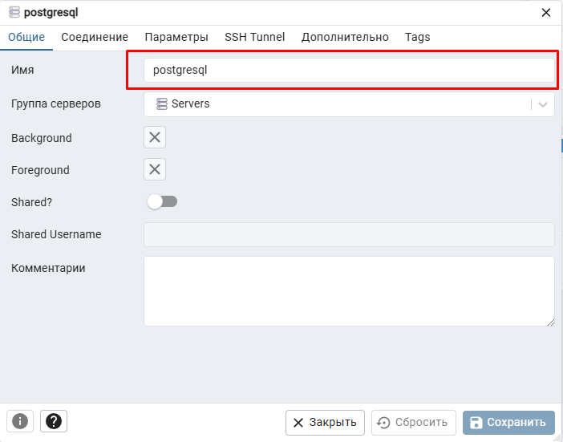
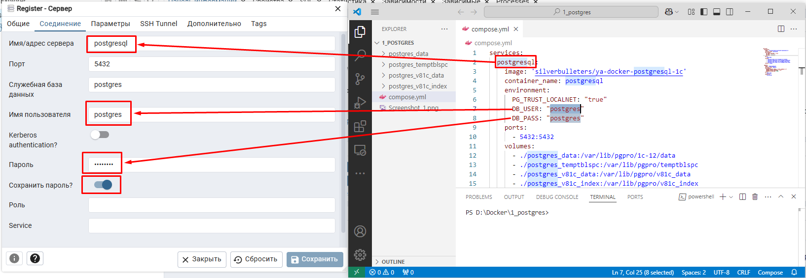
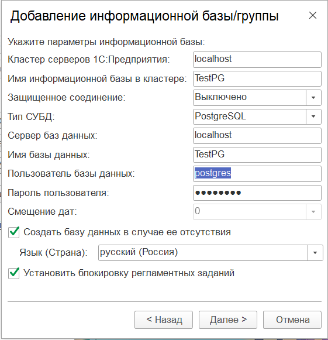

# PostgresPro 1C 17 в Docker + pgAdmin 4

Учебный проект: локальное окружение с СУБД **PostgresPro 1C 17** и веб-админкой **pgAdmin 4**, поднимаемое одной командой через Docker Compose. Предназначено для разработки и тестирования баз 1С:Предприятие 8.3 на PostgreSQL.

> ⚠️ Конфигурация рассчитана на **локальную машину разработчика**. Пароли лежат в открытом виде, доступ разрешён отовсюду — в продакшн в таком виде выкатывать нельзя.

---

## Состав репозитория

| Файл | Назначение |
|---|---|
| `Dockerfile` | Сборка образа: Debian bookworm → локаль `ru_RU.UTF-8` → репозиторий PostgresPro → пакет `postgrespro-1c-17` |
| `start.sh` | Точка входа контейнера: инициализирует кластер в `/pgdata` при первом запуске и стартует `postgres` |
| `compose.yml` | Два сервиса: `postgresql` (сборка из `Dockerfile`) и `pgadmin` (образ `dpage/pgadmin4`) |
| `docs/` | Скриншоты настройки подключения |

---

## Требования

- Docker Desktop / Docker Engine 20.10+
- Docker Compose v2 (`docker compose`)
- Свободные порты **5432** (СУБД) и **5050** (pgAdmin)
- Для создания баз 1С — установленный сервер 1С:Предприятие 8.3

---

## Быстрый старт

```bash
git clone <URL_репозитория>
cd 1_postgres

docker compose up -d --build
```

Первая сборка занимает несколько минут: скачивается Debian и пакеты PostgresPro.

Проверка, что всё поднялось:

```bash
docker compose ps
docker compose logs -f postgresql
```

Остановка:

```bash
docker compose stop          # остановить, данные сохранить
docker compose down          # удалить контейнеры, данные сохранить
docker compose down -v       # удалить контейнеры ВМЕСТЕ с данными БД
```

---

## Параметры подключения

Задаются в `compose.yml`, блок `environment` сервиса `postgresql`.

| Параметр | Значение |
|---|---|
| Пользователь | `postgres` |
| Пароль | `postgres` |
| Порт | `5432` |
| Хост **с машины разработчика** (1С, DBeaver, psql) | `localhost` |
| Хост **из контейнера pgAdmin** | `postgresql` (имя сервиса) |
| Служебная база | `postgres` |

Проверка подключения из консоли:

```bash
docker exec -it postgresql /opt/pgpro/1c-17/bin/psql -U postgres -c "select version();"
```

---

## Настройка pgAdmin

Админка доступна по адресу **http://localhost:5050**

Данные для входа берутся из `compose.yml`:

```yaml
PGADMIN_DEFAULT_EMAIL: "xxxx@mail.ru"     # подставьте свой e-mail
PGADMIN_DEFAULT_PASSWORD: "root"
```

После входа: **Object → Register → Server…**

**Вкладка «Общие»** — имя сервера произвольное, например `postgresql`:



**Вкладка «Соединение»** — здесь важно указать именно имя сервиса из `compose.yml`, а не `localhost`: pgAdmin работает в своём контейнере, и `localhost` для него — это он сам.

| Поле | Значение |
|---|---|
| Имя/адрес сервера | `postgresql` |
| Порт | `5432` |
| Служебная база данных | `postgres` |
| Имя пользователя | `postgres` |
| Пароль | `postgres` |
| Сохранить пароль | включить |



---

## Создание информационной базы 1С

В консоли администрирования серверов 1С: **Информационные базы → Создать → Информационная база**.

| Поле | Значение |
|---|---|
| Кластер серверов 1С:Предприятия | `localhost` |
| Имя информационной базы в кластере | `TestPG` |
| Защищённое соединение | Выключено |
| Тип СУБД | `PostgreSQL` |
| Сервер баз данных | `localhost` |
| Имя базы данных | `TestPG` |
| Пользователь базы данных | `postgres` |
| Пароль пользователя | `postgres` |
| Создать базу данных в случае её отсутствия | ✔ |
| Язык (Страна) | русский (Россия) |



Если сервер 1С работает на этой же машине, а СУБД — в контейнере с пробросом порта `5432:5432`, то в поле «Сервер баз данных» указывается `localhost` (при необходимости — `localhost port=5432`).

---

## ОБЯЗАТЕЛЬНО: если подключение не проходит

Скрипт `start.sh` при первичной инициализации кластера добавляет в `postgresql.conf` только `listen_addresses = '*'`. Правила доступа в `pg_hba.conf` при этом остаются такими, какими их сгенерировал `initdb` — то есть разрешён только `127.0.0.1` **внутри контейнера**. Поэтому подключения снаружи (из 1С, DBeaver) и из контейнера pgAdmin могут отбиваться с ошибкой вида `no pg_hba.conf entry for host ...`.

Порядок проверки и исправления:

**1. Зайти в контейнер:**

```bash
docker exec -it postgresql bash
```

**2. Проверить `listen_addresses`:**

```bash
cat /pgdata/postgresql.conf | grep listen_addresses
```

Должно быть:

```
listen_addresses = '*'
```

Если параметр закомментирован или равен `localhost` — отредактировать файл (`nano /pgdata/postgresql.conf`).

**3. Проверить `pg_hba.conf`:**

```bash
cat /pgdata/pg_hba.conf
```

Должна присутствовать строка, разрешающая подключения:

```
host    all             all             0.0.0.0/0               md5
```

Если её нет — добавить:

```bash
echo "host    all             all             0.0.0.0/0               md5" >> /pgdata/pg_hba.conf
```

**4. Перезапустить контейнер:**

```bash
docker compose restart postgresql
```

> Чтобы не делать это руками при каждом пересоздании тома, можно дописать строку `pg_hba.conf` прямо в `start.sh`, в блок первичной инициализации — рядом с добавлением `listen_addresses`.

---

## Как это устроено внутри

- Данные кластера лежат в именованном томе `pgdata`, смонтированном в `/pgdata`. Том переживает `docker compose down`, но удаляется при `down -v`.
- `start.sh` при старте проверяет наличие `/pgdata/PG_VERSION`. Если файла нет — значит том пустой, и выполняется `initdb` с паролем из переменной `DB_PASS` и аутентификацией `md5`. Если файл есть — инициализация пропускается и сразу запускается СУБД.
- Бинарники PostgresPro лежат в `/opt/pgpro/1c-17/bin/`.
- Локаль кластера — `ru_RU.UTF-8`, она задаётся через `ENV LANG` в `Dockerfile` и подхватывается `initdb`.

---

## Известные особенности

- Переменная `PG_TRUST_LOCALNET` в `compose.yml` осталась от готового образа `silverbulleters/ya-docker-postgresql-1c` и в текущей самосборной версии **не используется**. Её можно удалить или обработать в `start.sh`.
- Пароль применяется только при **первичной** инициализации тома. Смена `DB_PASS` в `compose.yml` на уже существующем томе ничего не изменит — пароль меняется через `ALTER USER postgres WITH PASSWORD '...';`.
- Явные настройки производительности под 1С (`shared_buffers`, `work_mem`, `max_locks_per_transaction`, `online_analyze`, `plantuner`) не задаются — используются значения по умолчанию.

---

## Безопасность

Перед публикацией репозитория:

- заменить реальный e-mail в `PGADMIN_DEFAULT_EMAIL` на плейсхолдер;
- пароли `postgres` / `root` — учебные, для любого доступного извне окружения их нужно менять;
- при желании вынести секреты в `.env` и подставлять в `compose.yml` через `${DB_PASS}`, добавив `.env` в `.gitignore`.
